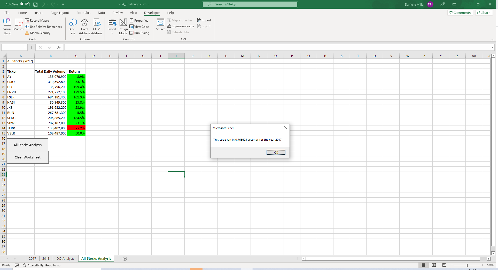
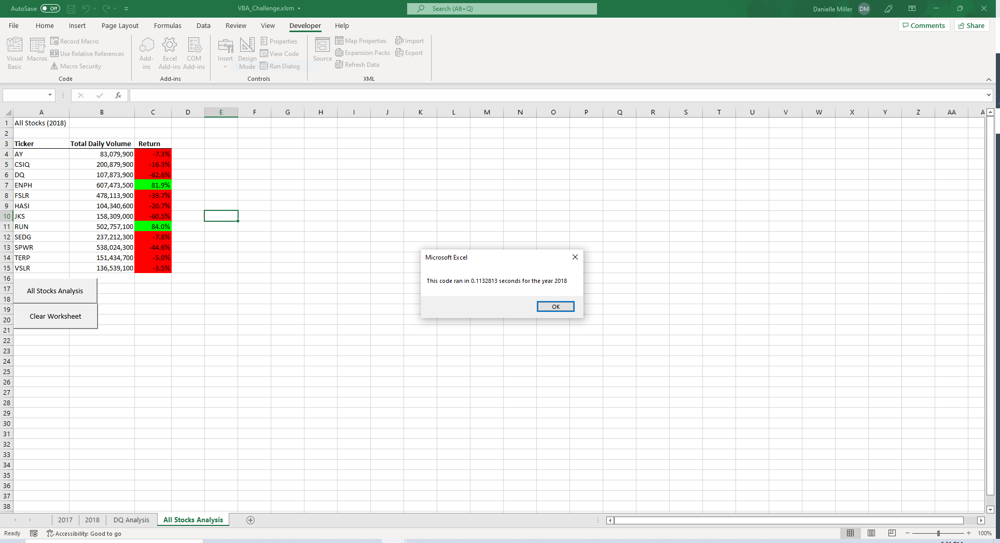

# VBA For Wall Street

## Overview of Project

This project utilized VBA logic in order to consolidate stock data for 12 clean energy stocks for a simple display.

### Purpose
Initially I was provided with 2 years of daily stock data for 2017 and 2018. The pertinent information manipulated for display was the closing price and volume information. This data was then used to calculate the year’s return and the total daily volume. The data was also formatted in VBA in order to create a chart that was pleasant to view and conditional formatting was used in order to allow the user to come to conclusions more quickly. In addition to this I created excel buttons in order to make the macros accessible to users unfamiliar with VBA code. After creating this display, I worked to improve the performance of the VBA macros through refactoring the code.

## Results
The end result of the display of the stock data was aesthetically pleasing and served its purpose. There was significant differences in performance between the original code and the refactored code.

### Analysis of Original Code
The original code took roughly 0.8 Seconds to run on my computer. For the small amount of data that was analyzed in this project the performance is likely acceptable. 

Screenshot of macro executing on 2017 data:

Screenshot of macro executing on 2018 data:

This code was written with a time complexity of O(n2).  This seems unnecessary because it is only required that data is either added each day (to calculate total daily volume), or data is saved at the beginning and end of the year for each stock (for the purposes of calculating return). 

Below is the original code with time complexity of O(n2):

### Analysis of Refactored Code
The refactored code had much better performance than the original code accomplishing the same task in roughly 0.11 seconds. This largely has to do with separating the nested for loops. This reduce the time complexity to O(n). 

Screenshot of refactored macro executing on 2017 data:

Screenshot of refactored macro executing on 2018 data:

Below is the refactored code with time complexity of O(n):

### Challenges and Difficulties Encountered
This project went smoothly, however I initially stumbled due to lack of consideration for the boundary conditions. At first I didn’t consider that the first iteration would meet the “last cell of ticker symbol” criteria and would cause the ticker index to be incremented prematurely. After trial and error I realized the issue with my code and modified it accordingly.
## Summary

- What are the advantages or disadvantages of refactoring code?
Overall this exercise shows that refactoring code can improve performance significantly, but for smaller data sets might not be worth the effort. 
-How do these pros and cons apply to refactoring the original VBA script?
In this example both versions of the code execute in under a second making both feasible for everyday use. If instead of working with 12 ticker symbols the macro was trying to work with 1000 ticker symbols it is likely that the original macro performance would be unacceptable and would potentially cause excel to crash.
